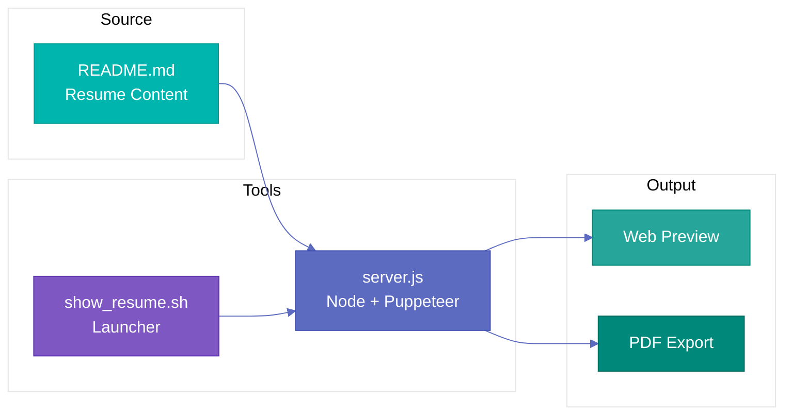
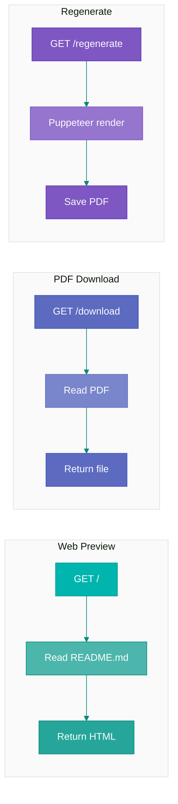
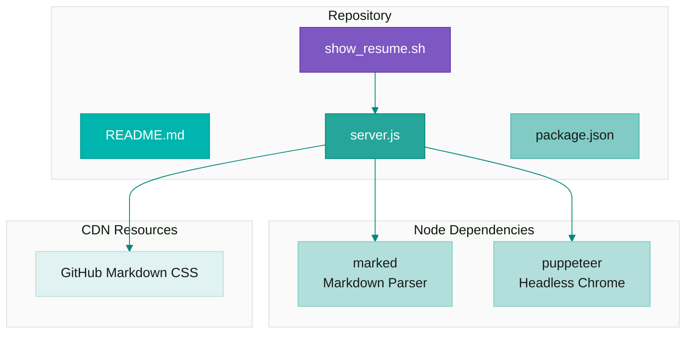

# Resume Tools

This repo hosts Matthew Valancy's resume. The `README.md` **is** the resume - view it directly on GitHub or use the tools below for local development and PDF export.

## How to Get a Job


---

## System Overview



## Request Flow



## Architecture



---

## Quick Start

```bash
./show_resume.sh
```

That's it. The script installs dependencies if needed and launches the server.

Opens at `http://localhost:9051` with:
- Live web preview (auto-reloads README.md on refresh)
- PDF download button
- `/regenerate` endpoint to rebuild the PDF

---

## Files

| File | Purpose |
|------|---------|
| `README.md` | The resume itself |
| `show_resume.sh` | Launcher script (runs the server) |
| `server.js` | Node server with Puppeteer PDF generation |
| `package.json` | Node dependencies |

## Endpoints (Node Server)

| Route | Description |
|-------|-------------|
| `/` | Live HTML preview of resume |
| `/download` | Download generated PDF |
| `/pdf` | Alias for `/download` |
| `/regenerate` | Rebuild PDF from current README.md |

## PDF Output

The server generates `Matthew_Valancy_Resume.pdf` on startup - this file is gitignored.
